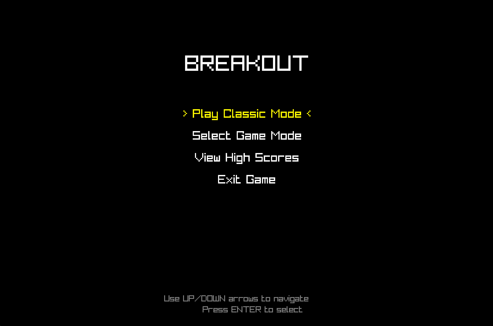
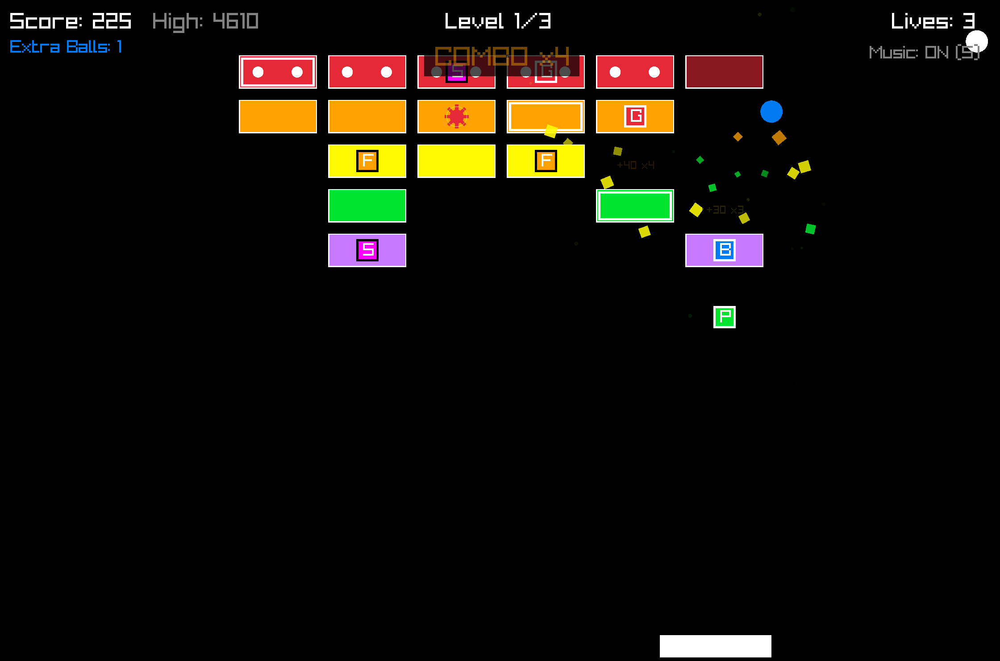
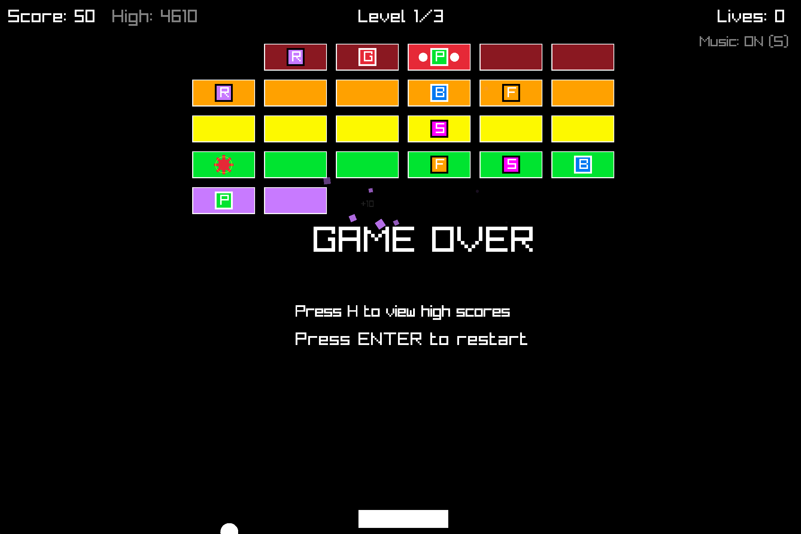
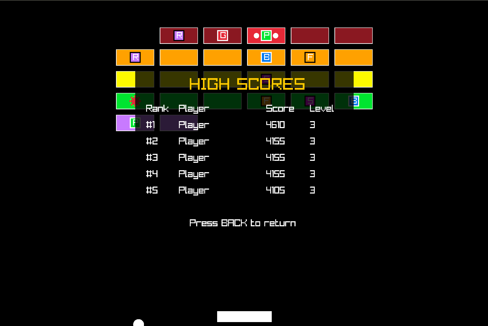

# Breakout Game

A classic Breakout game implementation built with C# and Raylib.

## Description

This is a recreation of the classic Breakout arcade game where the player controls a paddle at the bottom of the screen to bounce a ball upward to break bricks arranged at the top of the screen. The game features multiple levels of increasing difficulty with various brick patterns and types.

## Features

- Responsive paddle control
- Physics-based ball movement
- Multiple levels with different brick configurations
- Power-ups
- Score tracking
- Sound effects

## Screenshots

*Game menu screen*

*Main gameplay showing paddle, ball, and colorful bricks*

*Game Over*

*High scores are saved to a json file*

## Controls

- **Left/Right Arrow Keys**: Move paddle
- **Space**: Launch ball / Pause game
- **Escape**: Return to menu / Exit game
- **S**: Toggle music on/off
- **+/-**: Increase/decrease sound effects volume

## Development

This game was created with C# using the Raylib framework and was developed with assistance from GitHub Copilot using Claude 3.7 Sonnet.

## Attribution

### Sound Effects

- Sound effects used in this game are sourced from https://freesound.org/

## License

MIT License

Copyright (c) 2025

Permission is hereby granted, free of charge, to any person obtaining a copy
of this software and associated documentation files (the "Software"), to deal
in the Software without restriction, including without limitation the rights
to use, copy, modify, merge, publish, distribute, sublicense, and/or sell
copies of the Software, and to permit persons to whom the Software is
furnished to do so, subject to the following conditions:

The above copyright notice and this permission notice shall be included in all
copies or substantial portions of the Software.

THE SOFTWARE IS PROVIDED "AS IS", WITHOUT WARRANTY OF ANY KIND, EXPRESS OR
IMPLIED, INCLUDING BUT NOT LIMITED TO THE WARRANTIES OF MERCHANTABILITY,
FITNESS FOR A PARTICULAR PURPOSE AND NONINFRINGEMENT. IN NO EVENT SHALL THE
AUTHORS OR COPYRIGHT HOLDERS BE LIABLE FOR ANY CLAIM, DAMAGES OR OTHER
LIABILITY, WHETHER IN AN ACTION OF CONTRACT, TORT OR OTHERWISE, ARISING FROM,
OUT OF OR IN CONNECTION WITH THE SOFTWARE OR THE USE OR OTHER DEALINGS IN THE
SOFTWARE.
